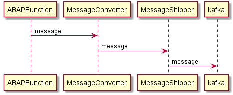

# abap-message-shipper :construction: WIP

# architecture

A Message can be sent in a *workflow event* or *directly*.

# local tests

https://github.com/JohannesKonings/docker-abap-message-shipper-tester